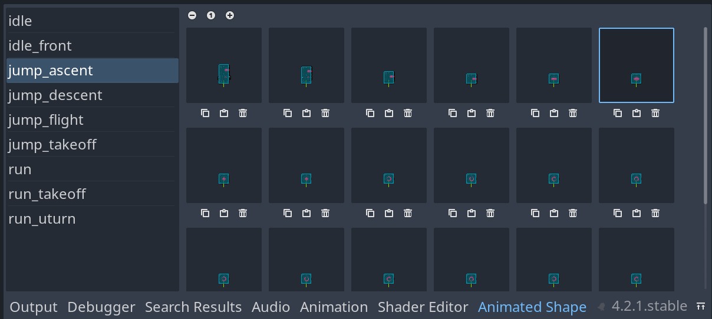

Animated Shape 2D Addon for Godot
---------------------------------

A [Godot](https://godotengine.org/) `4.x` addon that adds an `AnimatedShape2D` that can provide a custom shape for each frame of each animation of an `AnimatedSprite2D`.

It is useful to make custom hitboxes, hurtboxes, and hardboxes for each pose of your character, if you animated it using `AnimatedSprite2D`.

It comes with an Editor GUI to preview and edit your shapes, in the fashion of the `SpriteFrames` bottom panel.

Features
--------

- customize a shape for each frame of your animations
- configurable fallbacks
- editor GUI, updated in real time
- supports undo & redo where it matters
- extensible

Install
-------

The installation is as usual, through the `Assets Library` within Godot, look for [_AnimatedShape2D_](https://godotengine.org/asset-library/asset/2484).
You can also simply copy the files of this project into yours, it should work.

Then, **enable the plugin** in `Scene > Project Settings > Plugins`.

Usage
-----

Please see the [addons' README](./addons/goutte.animated_shape_2d/README.md).

-----

> 🦊 _Feedback and contributions are welcome!_

